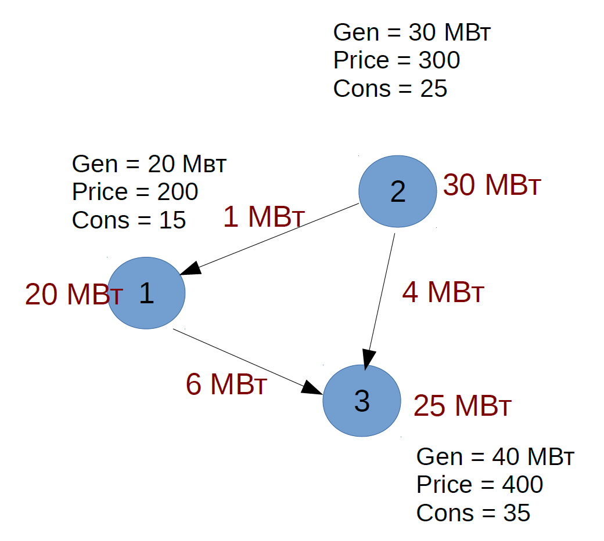

# Power Network Simulation

Небольшая программа на С++, реализующая решение задачи оптимального транспорта с помощью симплекс-метода.

## Постановка задачи

Дано:

- Набор вершин - потребителей и генераторов электроэнергии. Для каждой вершины заданы:
  - Величина потребления энергии.
  - Величина максимально возможной выработки энергии.
  - Цена выработки единицы энергии.

- Между вершинами есть линии передач (ребра графа):
  - По ребрам можно передавать энергию.
  - Каждое ребро имеет определенный коэффициент потерь при передаче.

Необходимо: для каждой вершины найти значения выработки энергии такие, чтобы удовлетворить спрос энергии в каждой из вершин и потратить на нее наименьшую сумму. 

## Пример сети

В сети три вершины и три линии передач. Потери при передаче энергии равны нулю. Красным указано оптимальное решение задачи.

## Литература

В папке [theory](theory/) есть теория по симплекс-методу на русском языке.